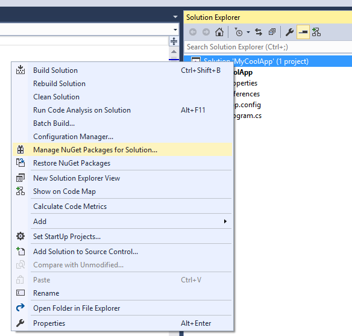
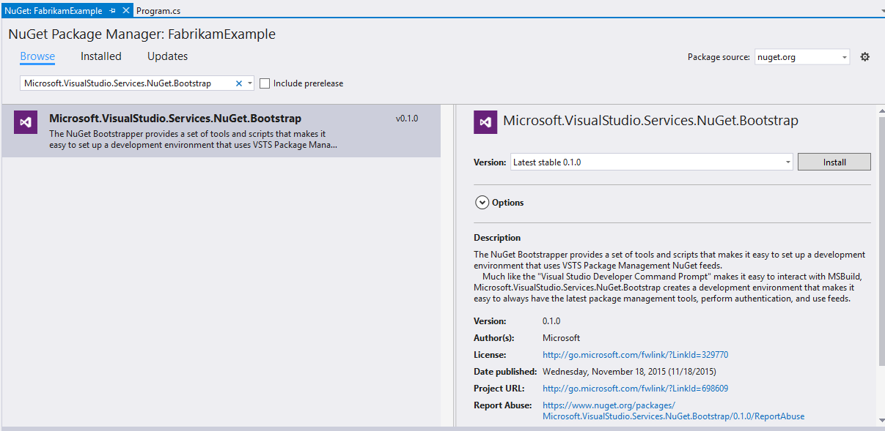
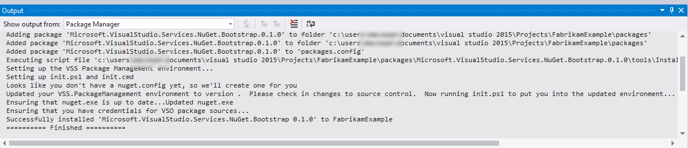
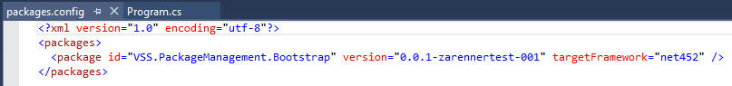

# Bootstrap a development environment for use with VSO Package Management

## Background
**VSS.PackageManagement.Bootstrap** provides a set of tools and scripts that makes it easy to set up a development environment that uses VSO Package Management.

Much like the "Visual Studio Developer Prompt" makes it easy to interact with MSBuild, **VSS.PackageManagement.Bootstrap** creates a development environment that makes it easy to always have the latest package management tools, perform authentication, and use feeds.

### Why use it?
1. Users don't need to have nuget.exe installed and on their path. The environment automatically fetches and uses the latest supported NuGet tooling.
2. Users don't need to manually configure credentials.  When initializing their development environment, the tooling automatically obtains authentication tokens if necessary.
3. Restore tool packages automatically during init.  The environment can easily be configured to download and configure tool packages (i.e. build/test tools), to help make your development environment self contained.
4. Self-updating.  By running a simple command, or optionally enabling auto-update, you'll always have the latest package management tools.

### How to use it?
* After following the *Get started* steps below, developers simply run "init.ps1" or "init.cmd" in a prompt when starting their work.

## Get started
There are multiple ways to get started, depending on your needs.

### From a sample repository
If you want to start from an existing example, or just play around, you can start from an existing sample repository.

First, clone the [sample repo](https://github.com/Microsoft/VSS.PackageManagement.Sample.git).  Then, change directories into the repo, and run init.cmd (CMD) or init.ps1 (Powershell).  That's it!
 * If you're cloning from the command line, you may need to set up [alternate credentials](http://blogs.msdn.com/b/buckh/archive/2013/01/07/how-to-connect-to-tf-service-without-a-prompt-for-liveid-credentials.aspx) or use a personal access token.
 * You should see output similar to the following:
	```
	d:\repos>git clone https://github.com/Microsoft/VSS.PackageManagement.Sample.git
	Cloning into 'VSS.PackageManagement.Sample'...
	Unpacking objects: 100% (41/41), done.
	Checking connectivity... done.
	
	d:\repos>cd VSS.PackageManagement.Sample
	
	d:\repos\VSS.PackageManagement.Sample>init.cmd
	Ensuring that NuGet is up to date... Updated NuGet
	Ensuring that you have credentials for VSO package sources...
	Already have credentials for NuGet.Bootstrap.Sample.
	...
	```
 * You can now modify the sample repository and make it your own.
 
### From the command line (new or existing project)
1. Open a PowerShell prompt and cd into the root of your repository.
2. Download nuget.exe from https://dist.nuget.org/win-x86-commandline/latest/nuget.exe. You can run `Invoke-WebRequest https://dist.nuget.org/win-x86-commandline/latest/nuget.exe -OutFile nuget.exe` in PowerShell.
3. Run the command ```<path_to_nuget.exe> install -OutputDirectory packages -Source "https://www.myget.org/F/vss-package-management/api/v3/index.json" VSS.PackageManagement.Bootstrap```
   ```
   PS C:\projects\MyCoolProject> nuget install -OutputDirectory packages -Source "https://www.myget.org/F/vss-package-management/api/v3/index.json" VSS.PackageManagement.Bootstrap
	Attempting to gather dependencies information for package 'VSS.PackageManagement.Bootstrap.0.0.1' with respect to project 'C:\projects\MyCoolProject', targeting 'Any,Version=v0.0'
	Attempting to resolve dependencies for package 'VSS.PackageManagement.Bootstrap.0.0.1' with DependencyBehavior 'Lowest'
	Resolving actions to install package 'VSS.PackageManagement.Bootstrap.0.0.1'
	Resolved actions to install package 'VSS.PackageManagement.Bootstrap.0.0.1'
	Adding package 'VSS.PackageManagement.Bootstrap.0.0.1' to folder 'packages'
	Added package 'VSS.PackageManagement.Bootstrap.0.0.1' to folder 'packages'
	Successfully installed 'VSS.PackageManagement.Bootstrap 0.0.1' to packages
   ```
4. Run the command ```.\packages\VSS.PackageManagement.Bootstrap.*\tools\Bootstrap.ps1``` to bootstrap and initialize your environment.
	```
	PS C:\project\MyCoolProject> .\packages\VSS.PackageManagement.Bootstrap.*\tools\Bootstrap.ps1
	The option -repoRoot was not specified, assuming current working directory
	Setting up the VSS Package Management environment...
	Setting up init.ps1 and init.cmd
	Looks like you don't have a nuget.config yet, so we'll create one for you
	Looks like you don't have a .gitignore yet, so we'll create one for you
	Updated your VSS.PackageManagement environment to version 0.0.1.  Please check in changes to source control.  Now running init.ps1 to put you into the updated environment...
	Ensuring that NuGet is up to date... Updated NuGet
	Ensuring that you have credentials for VSO package sources...
	Already have credentials for VSS.PackageManagement.Bootstrap.
	```

### From an existing project in Visual Studio
*Note: NuGet in Visual Studio 2015 currently requires a project to exist to install solution-level NuGet packages.  If you'd like to use this method but don't yet have a project, create a project and then follow these steps.*

1. Open the project in Visual Studio 2015.
2. Right click on the solution, and select "Manage NuGet Packages for Solution"

   

3. Use the settings dialog to add the package source "https://www.myget.org/F/vss-package-management/api/v3/index.json" with name "vss-package-management"
4. Switch to the "vss-package-management" package source, and find the package VSS.PackageManagement.Bootstrap.  Choose the latest version, and hit install.
   

5. You should see output similar to the following:
   

6. You may notice that a packages.config was either created or modified in your project, containing the package "VSS.PackageManagement.Bootstrap".  You can delete this file (or remove the entry for VSS.PackageManagement.Bootstrap) if you wish to prevent NuGet from restoring this package.  That is, the packages.config entry and package itself is no longer required once your environment is set up, although it will not hurt anything.
   

## Update
### From the command line
To update your environment, simply run ```.\scripts\init\Update-Environment.ps1```.  This will find the latest version available, compare it to your version, and (after prompting) update to the new environment.
``` 
PS C:\projects\MyCoolProject> .\scripts\init\Update-Environment.ps1
The option -repoRoot was not specified or was not found, assuming current working directory
Current version is 0.0.3
Newest version is 0.0.4
Update from 0.0.3 to 0.0.4? [y/n]: y
...
```

### From Visual Studio
If you left a project-level packages.config with the package "VSS.PackageManagement.Bootstrap", you can use Visual Studio to update the environment.
Simply use "Manage NuGet Packages for Solution" in the IDE to update the package.

Note that if you mix command-line updating with this method, the version "currently installed" by the IDE may not match the version actually installed. 